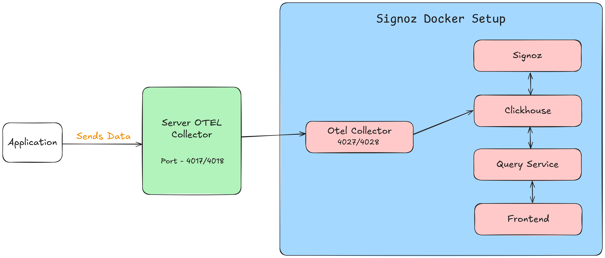

# Deploy

### Using Docker Compose

If you don't have docker-compose set up, please follow [this guide](https://docs.docker.com/compose/install/)
to set up docker compose before proceeding with the next steps.

For x86 chip (amd):

```sh
docker-compose -f docker/clickhouse-setup/docker-compose.yaml up -d
```

Open http://localhost:3301 in your favourite browser. In couple of minutes, you should see
the data generated from hotrod in SigNoz UI.

## Detailed Documentation
[Detailed](./Detailed.md)

## Architecture
